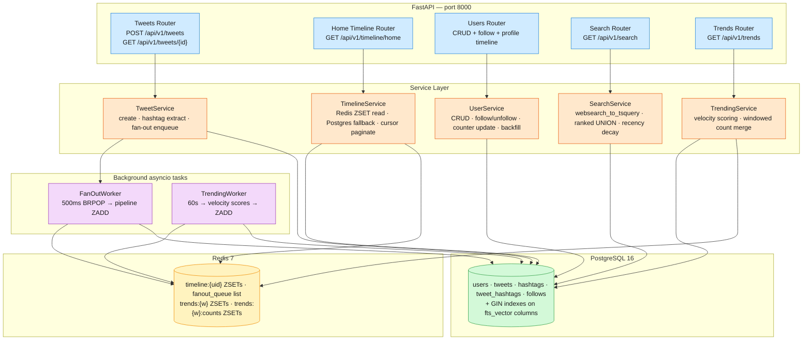

# Twitter/X Backend MVP

A real-time social platform backend implementing the core Twitter posting, timeline fan-out,
full-text search, and velocity-based trending loop. Serves REST endpoints via **FastAPI**
backed by **PostgreSQL 16** for durable storage and **Redis 7** for timeline caching,
fan-out dispatch, and trending computation.

## Quickstart

Requires Docker & Docker Compose v2.22+.

```bash
# Clone and enter the repo
git clone <repo-url> sd-twitter-x-backend
cd sd-twitter-x-backend

# Bootstrap environment
cp .env.example .env

# Build and start all services
docker compose up -d --build

# Run database migrations
docker compose run --rm app alembic upgrade head

# Verify the app is healthy
curl -sf http://localhost:8010/healthz
# → {"status":"ok"}
```

The API is now available at `http://localhost:8010`.

## Architecture



**Layering:** Routers parse HTTP and validate with Pydantic, then delegate to services — routers contain
zero business logic. Services own domain logic and data access. Redis caches pre-computed timelines
per user as sorted sets (`timeline:{user_id}`) and trending scores (`trends:{window}`); all
authoritative state lives in PostgreSQL. Fan-out and trending computation run as in-process `asyncio`
background tasks — no separate worker containers.

## API

| Method | Path | Purpose | Status codes |
|--------|------|---------|-------------|
| `GET` | `/healthz` | Health check | 200 |
| `POST` | `/api/v1/users` | Create user (username, optional display_name) | 201, 409, 422 |
| `GET` | `/api/v1/users/{id}` | Get user profile | 200, 404 |
| `GET` | `/api/v1/users/{id}/tweets` | Profile timeline (cursor-paginated) | 200, 400, 404 |
| `POST` | `/api/v1/users/{id}/follow?follower_id=` | Follow a user (idempotent) | 200, 404, 422 |
| `DELETE` | `/api/v1/users/{id}/follow?follower_id=` | Unfollow a user (idempotent) | 200, 404 |
| `POST` | `/api/v1/tweets` | Create tweet with text + optional hashtags | 201, 404, 422 |
| `GET` | `/api/v1/tweets/{id}` | Get tweet detail with author + hashtags | 200, 404 |
| `GET` | `/api/v1/timeline/home?user_id=` | Home timeline (cursor-paginated, 20/page) | 200, 404 |
| `GET` | `/api/v1/search?q=` | Full-text search across tweets and hashtags | 200 |
| `GET` | `/api/v1/trends?window=1h\|24h&limit=` | Velocity-ranked trending topics | 200, 422 |

All IDs are UUIDv4. All timestamps are ISO 8601. All endpoints are prefixed `/api/v1` except `/healthz`.

### Cursor pagination

Timeline and search endpoints use opaque base64-encoded JSON cursors for stable infinite-scroll
pagination. Each response returns `next_cursor` (or `null` for the last page). Offset-based
pagination is not used — cursor pagination is O(log N) regardless of page depth.

## Environment variables

| Variable | Default | Description |
|----------|---------|-------------|
| `APP_PORT` | `8010` | Host port mapped to the app container |
| `DATABASE_URL` | `postgresql+asyncpg://postgres:postgres@db:5432/twitter_x` | PostgreSQL connection |
| `REDIS_URL` | `redis://redis:6379/0` | Redis connection string |

Set these in `.env` (copy from `.env.example`). The stack works out of the box with defaults.

## Services

| Service | Image | Internal port | Health check |
|---------|-------|---------------|--------------|
| `db` | `postgres:16-alpine` | 5432 | `pg_isready -U postgres` |
| `redis` | `redis:7-alpine` | 6379 | `redis-cli ping` |
| `app` | (built from `Dockerfile`) | 8000 | `curl -sf http://localhost:8000/healthz` |

Only `app` publishes a host port (default 8010). `db` and `redis` are compose-internal.

## CI/CD

Three GitHub Actions workflows in `.github/workflows/`:

| Workflow | File | What it runs |
|----------|------|-------------|
| **lint** | `lint.yml` | `ruff check` + `ruff format --check` on `src/ tests/ verify/` |
| **ci** | `ci.yml` | Unit tests (Postgres service) + Docker build |
| **functional** | `functional.yml` | `docker compose up` → migrations → acceptance tests → teardown |

All workflows trigger on PR + push to `main` and a daily scheduled run.

## Test inventory

### White-box unit tests (`tests/`)

- **test_healthz.py** — 1 case: verifies `GET /healthz` returns 200 with `{"status":"ok"}` via ASGI transport (in-memory, no DB required).

### Black-box acceptance tests (`verify/acceptance/`)

| File | FR | Cases |
|------|-----|-------|
| `test_healthz.py` | Health check | 1 |
| `test_fr_user_crud.py` | User CRUD | 8 |
| `test_fr1_post_tweet.py` | FR1 — Post tweet | 12 |
| `test_fr2_home_timeline.py` | FR2 — Home timeline | 7 |
| `test_fr3_profile_timeline.py` | FR3 — Profile timeline | 5 |
| `test_fr4_search.py` | FR4 — Search | 9 |
| `test_fr5_follow.py` | FR5 — Follow/unfollow | 9 |
| `test_fr6_trending.py` | FR6 — Trending | 7 |

**Total: 58 test cases across 8 suites.** All tests are black-box (no `import` of the app) — they
exercise the system via HTTP.

## Degraded mode

The app starts and operates without Redis. When Redis is unavailable:
- Fan-out is skipped (timeline cache stays cold)
- Timeline reads fall back to Postgres
- Trending returns empty results
- All core CRUD and search operations work normally

On Redis reconnect, operations resume automatically.

## Project layout

```
sd-twitter-x-backend/
├── src/twitter_x/
│   ├── main.py                 # create_app() factory, lifespan, router registration
│   ├── config.py               # pydantic-settings (DATABASE_URL, REDIS_URL, APP_PORT)
│   ├── database.py             # async engine/session factory, get_session dependency
│   ├── redis.py                # Redis client with graceful None fallback
│   ├── models/                 # SQLAlchemy ORM (User, Tweet, Hashtag, TweetHashtag, Follow)
│   ├── schemas/                # Pydantic request/response models
│   ├── routers/                # FastAPI routers (thin — parse, delegate, return)
│   ├── services/               # Business-logic layer (TweetService, TimelineService, etc.)
│   └── workers/                # Background asyncio tasks (FanOutWorker, TrendingWorker)
├── tests/                      # White-box unit tests (ASGI transport)
├── verify/acceptance/          # Black-box acceptance tests (HTTP, one suite per FR)
├── alembic/                    # Database migrations (schema + recency_decay function)
├── .github/workflows/          # CI/CD (lint, ci, functional)
├── Dockerfile                  # Multi-stage build (python:3.12-slim)
├── docker-compose.yml          # 3 services: db, redis, app
├── .env.example                # Environment variable template (all commented)
├── DEPLOY.md                   # Deploy runbook
├── DESIGN.md                   # Full design document
├── pyproject.toml              # Project metadata + tool config
└── requirements.txt            # Pinned dependencies
```
